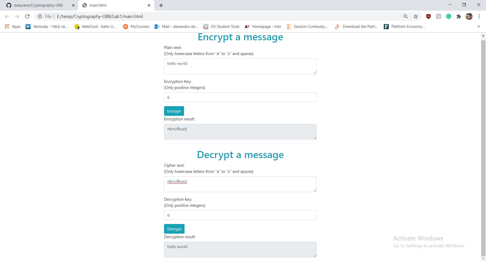
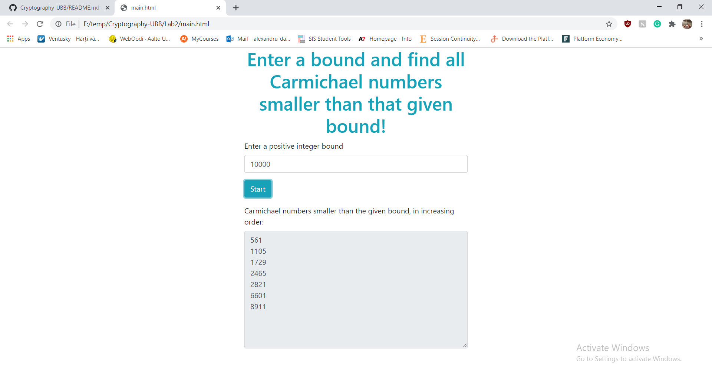
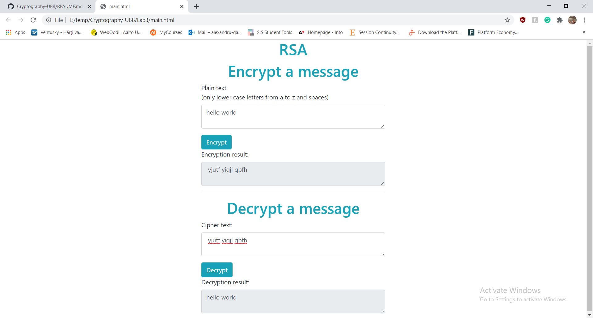

# Cryptography-UBB

This repository contains 3 JavaScript implementations of 3 algorithms related to Public Key Cryptgoraphy, and they were implemented during my 3rd year as a Bachelor student at UBB.

**Algorithms:**
1. **Caesar Cipher** encryption & decryption;
2. Finding all **Carmichael numbers** lower than a given bound (contains a function for computing the repeated squaring modular exponentiation method);
3. **RSA** encryption & decryption.

## How to start the algorithms:

All algorithms can be used through a simple web interface. For this, all you need to do is open the "main.html" file of each folder and then you can start using the algorith through the browser interface.

## Screenshots:

